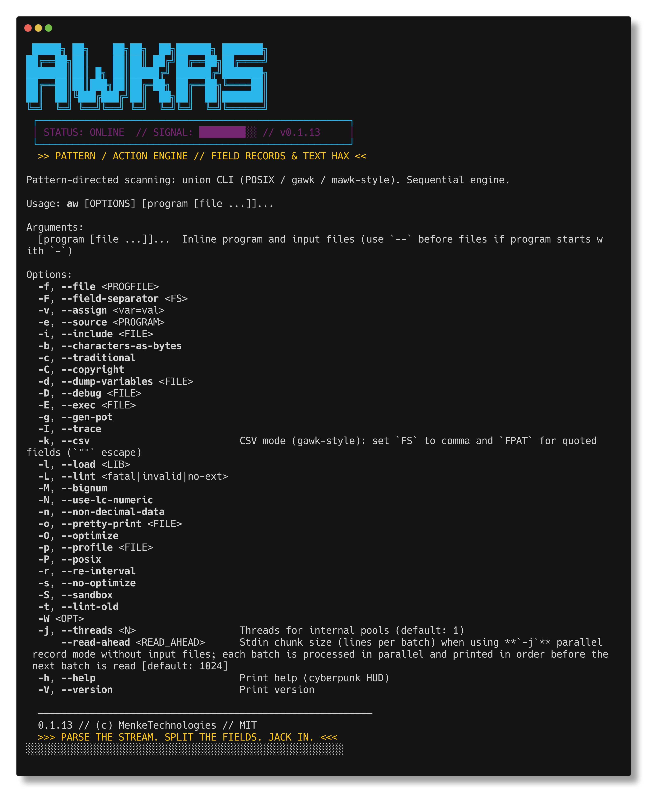

```
  █████╗ ██╗    ██╗██╗  ██╗██████╗ ███████╗
 ██╔══██╗██║    ██║██║ ██╔╝██╔══██╗██╔════╝
 ███████║██║ █╗ ██║█████╔╝ ██████╔╝███████╗
 ██╔══██║██║███╗██║██╔═██╗ ██╔══██╗╚════██║
 ██║  ██║╚███╔███╔╝██║  ██╗██║  ██║███████║
 ╚═╝  ╚═╝ ╚══╝╚══╝ ╚═╝  ╚═╝╚═╝  ╚═╝╚══════╝
```

[](https://github.com/MenkeTechnologies/awkrs/actions/workflows/ci.yml)
[](https://crates.io/crates/awkrs)
[](https://crates.io/crates/awkrs)
[](https://docs.rs/awkrs)
[](https://opensource.org/licenses/MIT)

### `[WORLDS FASTEST AWK BYTECODE ENGINE // PARALLEL RECORD PROCESSOR // RUST CORE]`

 ┌──────────────────────────────────────────────────────────────┐
 │ STATUS: ONLINE &nbsp;&nbsp; THREAT LEVEL: NEON &nbsp;&nbsp; SIGNAL: ████████░░ │
 └──────────────────────────────────────────────────────────────┘

> *"Pattern. Action. Domination."*

---

## [0x00] SYSTEM SCAN

`awkrs` runs **pattern → action** programs over input records (lines by default), similar to POSIX `awk`, GNU `gawk`, and `mawk`. The CLI accepts a **union** of common options from those implementations so scripts can pass flags through; see `--help` for which options affect behavior. **GNU-style flags** are implemented as follows: **`-d`**/`--dump-variables` dumps globals after the run (stdout, **`-`**, or a file); **`-D`**/`--debug` emits a rule/function listing (stderr or file); **`-p`**/`--profile` writes wall-clock timing (stderr or file); **`-o`**/`--pretty-print` and **`-g`**/`--gen-pot` print and exit before execution; **`-L`**/**`-t`** or a truthy **`LINT`** after **`BEGIN`** emit extension lint warnings; **`-S`**/`--sandbox` blocks `system()`, file redirects, pipes, coprocesses, and inet I/O; **`-l`** loads **`name.awk`** from **`AWKPATH`** (default `.`); **`-b`** uses byte length for **`length`**/**`substr`**; **`-n`** enables **`strtonum`**-style string→number coercion; **`-s`**/`--no-optimize` disables the Cranelift JIT; **`-c`**/**`-P`** are stored on the runtime for future dialect checks (minimal effect today). **Parallel file mode** (**`-j`** with a regular file) splits mmap input with the same **`RS`** rules as **`record_io::split_input_into_records`** (paragraph, regex, literal, newline); **stdin** parallel chunks still read **newline-delimited** lines. **`PROCINFO`** / **`FUNCTAB`** are refreshed after **`BEGIN`**; **`SYMTAB`** mirrors globals (not full gawk lvalue magic). **`@load "x.awk"`** inlines Awk source like **`@include`**; **`bindtextdomain`** loads **`.mo`** catalogs when present under **`locale/.../LC_MESSAGES/`** for **`dcgettext`** / **`dcngettext`**. **`/inet/udp/...`** is rejected with a clear error (only **`/inet/tcp/...`** with local port **`0`** is implemented).

**Positioning:** The implementation targets **POSIX awk** plus **practical gawk extensions** that show up in everyday scripts (e.g. `BEGINFILE` / `ENDFILE`, coprocess `|&`, CSV mode, many builtins). The **performance** goal is to beat typical `awk` / `mawk` / `gawk` on **supported** workloads (see benchmarks below)—**not** to claim parity with every dialect or extension.

**Not “all awks”:** Calling this “all functionality of all awk variants” would be inaccurate. **Gaps you hit early** when porting GNU awk scripts include:

- **`RS`** — default newline; **one character** (including one UTF-8 character) uses a literal byte/char delimiter; **`RS=""`** is paragraph mode; **more than one character** uses **gawk-style regex** record boundaries ( **`RT`** is the matched text). **`FIELDWIDTHS`** selects fixed-width fields when non-empty.
- **Gawk depth:** **`PROCINFO`** (pid, ids, platform, version, …) and **`FUNCTAB`** (user functions + arity) are refreshed after **`BEGIN`**; **`SYMTAB`** mirrors globals (not full gawk lvalue aliasing). **`@include "file"`** and **`@load "x.awk"`** expand before parse (relative paths resolve from the working directory or the including file’s directory; cycles are errors). Non-**`.awk`** **`@load`** targets error at parse time. **`@namespace`** is ignored with a stderr warning. **Indirect calls** (`@expr(…)`), **`/inet/tcp/lport/host/port`** TCP streams (local port must be **`0`** today; **`/inet/udp/…`** is rejected), and **`bindtextdomain`** / **`dcgettext`** / **`dcngettext`** (GNU **`.mo`** via the Rust **`gettext`** crate when catalogs exist under the bound directory) are implemented. **`-M` / `--bignum`** enables **MPFR** floating-point via the **`rug`** crate (default precision 256 bits; Cranelift JIT is disabled in this mode). See **Language coverage** for **`IGNORECASE`**, **`ARGIND`**, **`ERRNO`**, **`BINMODE`**, **`LINT`**, **`TEXTDOMAIN`**, etc.

#### HELP // SYSTEM INTERFACE


---

## [0x01] SYSTEM REQUIREMENTS

- Rust toolchain // `rustc` + `cargo`
- A **C compiler** and **Make** for **`gmp-mpfr-sys`** (pulled in by **`rug`** for **`-M`** / MPFR); typical macOS/Linux setups already satisfy this.

## [0x02] INSTALLATION

#### DOWNLOADING PAYLOAD FROM CRATES.IO

```sh
cargo install awkrs
```

#### COMPILING FROM SOURCE

```sh
git clone https://github.com/MenkeTechnologies/awkrs
cd awkrs
cargo build --release
```

[awkrs on Crates.io](https://crates.io/crates/awkrs)

#### ZSH COMPLETION // TAB-COMPLETE ALL THE THINGS

```sh
# add the completions directory to fpath in your .zshrc
fpath=(/path/to/awkrs/completions $fpath)
autoload -Uz compinit && compinit
```

---

## [0x03] LANGUAGE COVERAGE

 ┌──────────────────────────────────────────────────────────────┐
 │ SUBSYSTEM: LEXER ████ PARSER ████ COMPILER ████ VM ████     │
 └──────────────────────────────────────────────────────────────┘

Implemented end-to-end:

- **Rules:** `BEGIN`, `END`, **`BEGINFILE`** / **`ENDFILE`** (gawk-style, per input file), empty pattern, `/regex/`, expression patterns, **range patterns** (`/a/,/b/` or `NR==1,NR==5`).
- **Statements:** `if` / `while` / **`do … while`** / `for` (C-style and `for (i in arr)`), blocks, **`switch`** / **`case`** / **`default`** (gawk-style: no fall-through; **`case /regex/`** regex match; **`break`** exits the **`switch`** only), **`print`** (with no expressions, prints **`$0`**; **`print … >`** / **`>>`** / **`|`** / **`|&`** redirection), **`printf fmt, expr…`** (statement form, same redirections as **`print`**; no automatic newline—add **`\n`** in the format), `break`, `continue`, **`next`**, **`nextfile`** (skip the rest of the current input file, then continue with the next file—like **`next`** but per file; invalid in **`BEGIN`** / **`END`** / **`BEGINFILE`** / **`ENDFILE`**), **`exit`**, **`delete`**, **`return`** (inside functions), **`getline`** (primary input, **`getline < file`**, and **`getline <& cmd`** for two-way / coprocess reads).
- **Data:** fields (`$n`, `$NF`), scalars, **associative arrays** (`a[k]`, **`a[i,j]`** with **`SUBSEP`**), **`ARGC`** / **`ARGV`** (initialized before **`BEGIN`**: **`ARGV[0]`** is the executable name, **`ARGV[1]`** … are input file paths—none when reading stdin only), **`expr in array`** (membership: right-hand side is the array name), **`FS`** (field separator) and **`FPAT`** (gawk-style: non-empty **FPAT** splits `$0` by regex matches—each match is one field; empty **FPAT** uses **FS**), **`split`** (third argument and **`FS`** support **regex** when multi-character, per POSIX), **`patsplit`** (2–4 args; optional fourth array **`seps`** holds text between successive fields), string/number values. **Increment/decrement** (gawk-style): **`++` / `--`** as prefix or postfix on variables, **`$n`**, and **`a[k]`** (numeric coercion per awk rules).
- **Records & env:** **`RS`** / **`RT`** as above. **`ENVIRON`** from the process environment at startup. **`CONVFMT`** for number→string coercion; **`OFMT`** for **`print`** of numbers. **`FIELDWIDTHS`**: non-empty → fixed-width **`$n`** (overrides **FPAT**/**FS** for that record). **`IGNORECASE`**: truthy → case-insensitive regex cache (**`~`**, **`match`**, **`gsub`**, multi-char **`FS`**/**`FPAT`**, **`split`**), and case-insensitive string **`==`** / **`!=`** / ordering (ordering uses lowercase + **`strcoll`**). **`ARGIND`**: index into **`ARGV`** for the current file ( **`0`** on stdin-only). **`ERRNO`**: set on some failed **`open`** / **`mmap`** paths; cleared on success. **`LINT`**: truthy after **`BEGIN`** (or **`-L`**) enables extension lint diagnostics. **`TEXTDOMAIN`** / **`BINMODE`**: variables present; **`PROCINFO["awkrs_binmode"]`** mirrors **`BINMODE`** (Unix text mode is unchanged). **`PROCINFO`**, **`FUNCTAB`**, **`SYMTAB`**: populated after **`BEGIN`** as described above.
- **CLI (gawk-style):** **`-k`** / **`--csv`** enables **CSV mode** (comma-separated records, double-quoted fields, **`""`** for a literal **`"`** in a field): sets **`FS`** and **`FPAT`** like GNU awk’s introspection, and splits records with a dedicated CSV parser aligned with **`gawk --csv`** (quoted commas do not start a new field). Applied after **`-v`** / **`-F`** so it can override those for CSV workflows.
- **Functions:** builtins (`length`, `index`, `substr`, **`split`**, **`sprintf`** / **`printf`** (flags; **`*`** and **`%n$`** for width/precision/value, including forms like **`%*2$d`**; common conversions `%s` `%d` `%i` `%u` `%o` `%x` `%X` `%f` `%e` `%E` `%g` `%G` `%c` `%%` — **`%g`** / **`%G`** follow C-style short float rules, not `%f`-only), **`gsub`** / **`sub`** / **`match`**, **`gensub`** (gawk-style 3–4 args), **`isarray`**, `tolower` / `toupper`, `int`, POSIX math (**`sin`**, **`cos`**, **`atan2`**, **`exp`**, **`log`**), `sqrt`, `rand` / `srand`, **`systime()`**, **`strftime`** (0–3 args, gawk-style), **`mktime`** (string datespec), `system`, `close`, **`fflush`** (stdout, empty string, open **`>`/`>>`** files, open **`|`** pipes, or open **`|&`** coprocesses), gawk-style bitwise **`and`** / **`or`** / **`xor`** / **`lshift`** / **`rshift`** / **`compl`**, **`strtonum`** (hex **`0x…`**, leading-zero octal, else decimal), **`asort`** / **`asorti`** (sort an array by value or by key into **`"1"`…`"n"`** indices, optional second destination array)), and **user-defined `function`** with parameters and locals (parameters are local; other names assign to globals, matching classic awk).
- **I/O model:** The main record loop and **`getline` with no redirection** share one **`BufReader`** on stdin or the current input file so line order matches POSIX expectations. **`exit`** sets the process status; **`END` rules still run** after `exit` from `BEGIN` or a pattern action (POSIX-style), then the process exits with the requested code.
- **Locale & pipes:** On Unix, string **`==`**, **`!=`**, and relational ordering use **`strcoll`** (honors **`LC_COLLATE`** / **`LC_ALL`**). **`|&`** / **`getline … <&`** run the command under **`sh -c`** with stdin and stdout connected; mixing **`|`** and **`|&`** on the same command string is an error. **`system(cmd)`** runs **`cmd`** via **`sh -c`**. With **`-N`** / **`--use-lc-numeric`**, **`LC_NUMERIC`** is applied and **`sprintf`** / **`printf`** use the locale decimal radix for float conversions (**`%f`** / **`%e`** / **`%g`** / **`%E`** / **`%F`** / **`%G`**); without **`-N`**, those conversions use **`.`**.
- **Gawk extras:** Source directives (**`@include`**, **`@load "*.awk"`**, **`@namespace`**), **indirect calls** (**`@name()`** / **`@(expr)(…)`**), **`/inet/tcp/…`** client TCP (gawk-style path), **gettext-style** builtins (**`bindtextdomain`**, **`dcgettext`**, **`dcngettext`** with **`.mo`** catalogs), and **`-M` / `--bignum`** (MPFR) as above.

---

## [0x04] MULTITHREADING // PARALLEL EXECUTION GRID

```
 ┌─────────────────────────────────────────────┐
 │  WORKER 0  ▓▓  CHUNK 0   ██ REORDER QUEUE  │
 │  WORKER 1  ▓▓  CHUNK 1   ██ ──────────────>│
 │  WORKER 2  ▓▓  CHUNK 2   ██  DETERMINISTIC │
 │  WORKER N  ▓▓  CHUNK N   ██  OUTPUT STREAM  │
 └─────────────────────────────────────────────┘
```

By default **`-j`** / **`--threads`** is **1**. Pass a higher value when the program is **parallel-safe** (static check: no range patterns, no `exit`, no **`nextfile`**, no primary `getline`, no **`getline <&`** coprocess, no `delete`, no **`asort`** / **`asorti`**, no indirect function calls (**`@…`**), no **`print`/`printf` redirection** to files, pipes, or coprocesses, no cross-record assignments or other mutating expressions in record rules or user functions); then **records are processed in parallel** with **rayon** and `print` / `printf` output is **reordered to input order** within each batch so pipelines stay deterministic. **Regular files** are **memory-mapped** (`memmap2`) and scanned into per-record `String`s for workers—no extra `read()` copy of the whole file into a heap `Vec<u8>`, with the OS paging large inputs. **Stdin-only** input uses **chunked streaming**: up to **`--read-ahead`** lines (default **1024**) are buffered, that batch is dispatched to workers, output is emitted in order, then the next batch is read—so parallel speedups apply to piped input without loading all of stdin. Parallel workers execute the **same bytecode VM** as the sequential path (`vm_pattern_matches` / `vm_run_rule`); the compiled program is shared via **`Arc<CompiledProgram>`** (one compile, cheap refcount per worker) with **per-worker** runtime state (slots, VM stack, field buffers, captured print lines).

If the program is not parallel-safe, the engine **falls back to sequential** processing and prints a **warning** when **`-j`** is greater than **1** (use a **single thread** to silence the warning). **`END`** still sees only **post-`BEGIN`** global state (record-rule mutations from parallel workers are not merged into the main runtime).

**Tradeoff:** Parallel mode still builds one **`String` per record** for workers; the **file bytes** are mapped read-only, not duplicated in a heap buffer. Stdin parallel mode buffers **`--read-ahead`** lines at a time (not the full stream).

---

## [0x05] BYTECODE VM // EXECUTION CORE

 ┌──────────────────────────────────────────────────────────────┐
 │ ARCHITECTURE: STACK VM &nbsp;&nbsp; OPTIMIZATION: PEEPHOLE FUSED     │
 └──────────────────────────────────────────────────────────────┘

The engine compiles AWK programs into a flat bytecode instruction stream, then runs them on a stack-based virtual machine. This eliminates the recursive AST-walking overhead of a tree interpreter — no per-node pattern matching, no heap pointer chasing through `Box<Expr>`, and better CPU cache locality from contiguous instruction arrays. Short-circuit `&&`/`||` and all control flow (loops, break/continue, if/else) are resolved to jump-patched offsets at compile time. **Range patterns** (`/a/,/b/` or expression endpoints) compile both endpoints to the same bytecode forms as ordinary patterns (regex / literal / expr chunk / always / never); record matching uses **`vm_range_step`** on the VM, not AST walks. The string pool interns all variable names and string constants so the VM refers to them by cheap `u32` index.

**Cranelift JIT (experimental):** The **`jit`** module uses **Cranelift** + **`cranelift-jit`** with ISA flag **`opt_level = speed`** (Cranelift’s default is **`none`**; **`speed`** improves register allocation, instruction selection, and DCE on emitted code) to compile eligible bytecode chunks into native code with ABI **`(vmctx, slots, field_fn, array_field_add, var_dispatch, field_dispatch, io_dispatch, val_dispatch) -> f64`** — an opaque **`vmctx`** pointer (`*mut c_void` to the active interpreter context) plus seven **`extern "C"`** callback pointers covering field reads, fused array updates, HashMap-path scalar ops, dynamic-field mutations, print side-effects, and multiplexed match/signal/iterator operations. Callers pass a **`JitRuntimeState`** (opaque **`vmctx`**, mutable **`f64`** slot slice + those seven callbacks); every callback receives **`vmctx`** as its first argument so the runtime does not rely on thread-local storage to find **`VmCtx`** / **`Runtime`**. **Tiered compilation:** each chunk counts **`Chunk::jit_invocation_count`**; the VM only attempts JIT after **`AWKRS_JIT_MIN_INVOCATIONS`** entries (default **3**; set **1** to compile on the first entry). **`try_compile_with_options`** with **`JitCompileOptions::vm_default`** emits a direct **`call`** to the **`jit_field_callback`** symbol for field reads (not **`call_indirect`** through the **`field_fn` parameter); field *values* are still parsed from record text (**`field_as_number`**), not a single memory load. In mixed chunks, fused **`AddFieldToSlot`** / **`AddMulFieldsToSlot`** emit that field callback first, then **`val_dispatch`** opcodes that only coerce/update the slot (**`MIXED_ADD_FIELDNUM_TO_SLOT`** / **`MIXED_ADD_MUL_FIELDNUMS_TO_SLOT`**), avoiding a second field parse for the same **`$n`**. Eligible ops include constants, slot and HashMap-path scalar ops (when numeric; **`GetVar`** forces mixed mode for the whole chunk so locals/globals and **`return`** preserve full **`Value`** semantics on the JIT stack), arithmetic and comparisons, jumps and fused loop tests, field access (constant **`PushFieldNum`** — always **field callback** semantics like **`field_as_number`**, including in mixed chunks; dynamic **`GetField`**, NR/FNR/NF, fused **`AddFieldToSlot`** / **`AddMulFieldsToSlot`**), fused **`ArrayFieldAddConst`** (numeric field index only), general array subscripts and string ops in **mixed mode** (NaN-boxed string handles on the stack; **`val_dispatch`** opcodes ≥ 100 **`MIXED_*`** — including fused **`IncrSlot`** / **`AddFieldToSlot`** / **`JumpIfSlotGeNum`** / related slot peepholes when the chunk is mixed, so numeric-string slots coerce like **`Value::as_number`**; dynamic **`$i = …`** / **`$i += …`** use the same **`MIXED_*`** path when the chunk is mixed; multidimensional **`a[i,j]`** keys use **`JoinArrayKey`** → **`MIXED_JOIN_*`** with **`SUBSEP`**), **`typeof`** on scalars, fields, array elements, and arbitrary expressions (**`MIXED_TYPEOF_*`**), a **whitelist** of builtins via **`Op::CallBuiltin`** (**`MIXED_BUILTIN_ARG`** / **`MIXED_BUILTIN_CALL`** — math/string helpers, **`sprintf`** / **`printf`**, **`strftime`**, **`fflush`** / **`close`** / **`system`**, **`typeof`**, with a capped arg count), **`split(s, arr [, fs])`** (**`Op::Split`** — **`MIXED_SPLIT`** / **`MIXED_SPLIT_WITH_FS`**), **`patsplit`** (**`Op::Patsplit`** — multiple **`MIXED_PATSPLIT_*`**; FPAT + **`seps`** packs two pool indices in **`a1`** when both are &lt; 65536, otherwise stash + **`MIXED_PATSPLIT_FP_SEP_WIDE`**), **`match(s, re [, arr])`** (**`Op::MatchBuiltin`**), **`$n`** compound / **`++$n`** / **`$n++`**, **fused print opcodes** (**`PrintFieldStdout`**, **`PrintFieldSepField`**, **`PrintThreeFieldsStdout`**, bare **`print`**, **`print`** / **`printf`** with arguments on stdout in mixed mode — **`printf`** uses **`MIXED_PRINTF_FLUSH`**; redirects (`>`, `>>`, `|`, `|&`) use **`MIXED_PRINT_FLUSH_REDIR`** / **`MIXED_PRINTF_FLUSH_REDIR`** with **`pack_print_redir`**), **`MatchRegexp`** pattern tests, **flow signals** (**`Next`**, **`NextFile`**, **`ExitDefault`**, **`ExitWithCode`**, **`ReturnVal`**, **`ReturnEmpty`**), **`for`-`in` iteration** (**`ForInStart`** / **`ForInNext`** / **`ForInEnd`** — iterator state in thread-local, key stored in variable via callback), and **`asort`** / **`asorti`** (array sorting via callback, returning count), **`CallUser`** (**`MIXED_CALL_USER_ARG`** / **`MIXED_CALL_USER_CALL`**), and **`sub`**/**`gsub`** (**`MIXED_SUB_*`** / **`MIXED_GSUB_*`** — record, slot/var, field, or array index). The **`io_dispatch`** callback handles fused print opcodes that only touch fields as void side-effects. The **`val_dispatch`** callback multiplexes **`MatchRegexp`** (regex tested against `$0`), mixed-mode string/array/regex/print-arg operations (**`MIXED_*`**), flow signals (set a thread-local flag; the VM translates to **`VmSignal::Next`** / **`ExitPending`** / **`Return`** etc. after JIT returns), **`ForIn`** iteration (collecting array keys, advancing the iterator, storing the current key in the loop variable), and **`asort`** / **`asorti`**. The VM tries the JIT for whole chunks that pass **`is_jit_eligible`**; set **`AWKRS_JIT=0`** to force the bytecode interpreter (e.g. JIT vs VM benchmarks) — the variable is read on each dispatch, not cached at startup. Non-mixed chunks without early flow signals may keep scalar slots in Cranelift SSA (φ-nodes at loop headers and joins); values are written back to the slot buffer before return. (Mixed chunks mirror **`Value`** in slots via NaN-boxing — **`Value::Uninit`** uses a dedicated quiet-NaN tag, not raw **`0.0`**; flow **`ReturnVal`** decodes the returned **`f64` as a full **`Value`** (including dynamic strings) before clearing thread-local string storage.) **`CallUser`** and **`sub`**/**`gsub`** compile in mixed mode when **`jit_call_builtins_ok`** and stack rules pass; nested JIT passes the inner context as **`vmctx`** in the native frame. Unsupported opcodes still fall back to the bytecode loop. **`getline`** (primary input, **`getline < file`**, **`getline <&` coproc**) compiles via **`MIXED_GETLINE_*`** when the chunk is otherwise eligible. The library-only legacy helpers **`try_compile_numeric_expr`** / **`is_numeric_stack_eligible`** accept straight-line constant stack math (no jumps — excludes **`Jump`**, **`JumpIf*`**, **`JumpIfSlotGeNum`**, …) including **`%`**, comparisons (**`Cmp*`**), **`Not`** / **`ToBool`**, unary **`+`**, **`Dup`**, **`GetField`**, **`GetSlot`** / **`SetSlot`** / **`CompoundAssignSlot`**, fused **`IncrSlot`** / **`DecrSlot`** / **`AddSlotToSlot`** / **`AddFieldToSlot`** / **`AddMulFieldsToSlot`**, **`PushFieldNum`**, and **`GetNR`** / **`GetFNR`** / **`GetNF`** — same ops the full JIT already compiled; slot storage is sized by **`numeric_stack_slot_words`**; **`call_f64`** still uses stub callbacks (fields/NR return `0.0`; use the VM for real I/O and specials).

**Peephole optimizer:** a post-compilation pass fuses common multi-op sequences into single opcodes — `print $N` becomes `PrintFieldStdout` (writes field bytes directly to the output buffer, zero allocations), `s += $N` becomes `AddFieldToSlot` (parses the field as a number in-place without creating an intermediate `String`), `i = i + 1` / `i++` / `++i` becomes `IncrSlot` and `i--` / `--i` becomes `DecrSlot` (one f64 add instead of push+pop stack traffic), `s += i` between slot variables becomes `AddSlotToSlot` (two f64 reads + one write, no stack traffic), `$1 "," $2` string literal concatenation becomes `ConcatPoolStr` (appends the interned string directly to the TOS buffer — no clone from the string pool), and HashMap-path `NR++` / `NR--` statements fuse to `IncrVar` / `DecrVar` (skip pushing a result that's immediately discarded). Jump targets are adjusted automatically after fusion.

**Inline fast path:** single-rule programs with one fused opcode (e.g. `{ print $1 }`, `{ s += $1 }`) bypass VmCtx creation, pattern dispatch, and the bytecode execute loop entirely — the operation runs as a direct function call in the record loop. Memory-mapped **regular files** also recognize `{ gsub("lit", "repl"); print }` on `$0` with a literal pattern and simple replacement: when the needle is absent, the loop writes each line from the mapped buffer with **ORS** and skips VM + field split.

**Raw byte field extraction:** for `print $N` with default FS, the throughput path skips record copy, field splitting, and UTF-8 validation entirely — it scans raw bytes in the mapped file buffer to find the Nth whitespace-delimited field, writes it to the output buffer, then appends **`ORS`** from the same cached **`Runtime::ors_bytes`** as the VM (not a hardcoded newline). Slurp inline paths append full **`OFS`** / **`ORS`** byte slices — no length cap.

**Indexed variable slots:** scalar variables are assigned `u16` slot indices at compile time and stored in a flat `Vec<Value>` — variable reads and writes are direct array indexing instead of `HashMap` lookups. Special awk variables (`NR`, `FS`, `OFS`, …) and array names remain on the HashMap path.

**Zero-copy field splitting:** fields are stored as `(u32, u32)` byte-range pairs into the record string instead of per-field `String` allocations. Owned `String`s are only materialized when a field is modified via `set_field`.

**Direct-to-buffer print:** the stdout print path writes `Value::write_to()` directly into a persistent 64 KB `Vec<u8>` buffer (flushed at file boundaries), eliminating per-record `String` allocations, `format!()` calls, and stdout locking.

**Cached separators:** OFS/ORS bytes are cached on the runtime and updated only when assigned, eliminating per-`print` HashMap lookups.

**Byte-level input:** records are read with `read_until(b'\n')` into a reusable `Vec<u8>` buffer, skipping per-line UTF-8 validation and `String` allocation.

**Regex cache:** compiled `Regex` objects are cached in a `HashMap<String, Regex>` so patterns are compiled once, not per-record.

**Field split (lazy path):** `ensure_fields_split` reads **`FS`** / **`FPAT`** when splitting (or uses the CSV scanner when **`-k`** / **`--csv`** set `Runtime::csv_mode`); `cached_fs` is still updated when the record is set for bookkeeping.

**`sub` / `gsub`:** when the target is `$0`, the engine applies the new record in one step (no restore-then-overwrite of the old string). Literal patterns with zero matches skip `set_field_sep_split`; literal needles reuse a cached **`memmem::Finder`** for the scan (no `str::contains` per line). `sub`/`gsub` VM opcodes pass pattern/replacement `&str` via `Cow` so constant string operands do not allocate per call.

**Numeric fields:** `parse_number` fast-paths plain decimal integer field text (common for `seq`-style data) before falling back to `str::parse::<f64>()`.

**Slurped input:** newline scanning in the file fast paths uses the `memchr` crate for byte search.

**Parallel** mode shares the compiled program via **`Arc`** across rayon workers (zero-copy); each worker gets its own stack, slots, and runtime overlay.

---

## [0x06] BENCHMARKS // COMBAT METRICS (vs awk / gawk / mawk)

 ┌──────────────────────────────────────────────────────────────┐
 │ HARDWARE: APPLE M5 MAX &nbsp;&nbsp; OS: macOS &nbsp;&nbsp; ARCH: arm64         │
 └──────────────────────────────────────────────────────────────┘

Measured with [hyperfine](https://github.com/sharkdp/hyperfine). BSD awk (`/usr/bin/awk`), GNU gawk 5.4.0, mawk 1.3.4, awkrs **0.1.18**. **Relative** = mean time ÷ **fastest** mean in that table. **awkrs** has two rows: default (**JIT** attempted) vs **`AWKRS_JIT=0`** (**bytecode** only). **Every §N table below is a single `hyperfine` invocation** with all five commands on the same **1 M-line** input, generated **2026-04-10** UTC by `./scripts/benchmark-vs-awk.sh` and taken verbatim from [`benchmarks/benchmark-results.md`](benchmarks/benchmark-results.md) — the *Relative* column is apples-to-apples within each table (earlier revisions of this README stitched awkrs rows from one run with mawk/gawk rows from another; that is no longer the case). 1 M lines was chosen to lift every workload above hyperfine's ~5 ms shell-startup noise floor; re-run with `AWKRS_BENCH_LINES=500000 ./scripts/benchmark-vs-awk.sh` for a faster sweep or larger values for throughput-limit checks. For the awkrs-only JIT-vs-bytecode A/B at a tighter focus, see [`benchmarks/benchmark-readme-jit.md`](benchmarks/benchmark-readme-jit.md) from `./scripts/benchmark-readme-jit-vs-vm.sh`.

### 1. Throughput: `{ print $1 }` over 1 M lines

| Command | Mean | Min | Max | Relative |
|:---|---:|---:|---:|---:|
| BSD awk | 195.0 ms | 179.8 ms | 221.6 ms | 12.43× |
| gawk | 100.8 ms | 92.8 ms | 115.8 ms | 6.42× |
| mawk | 66.2 ms | 61.9 ms | 78.4 ms | 4.22× |
| awkrs (JIT) | 15.7 ms | 13.3 ms | 19.6 ms | **1.00×** |
| awkrs (bytecode) | 16.1 ms | 13.1 ms | 20.2 ms | 1.03× |

### 2. CPU-bound BEGIN (no input)

`BEGIN { s = 0; for (i = 1; i < 400001; i = i + 1) s += i; print s }`

| Command | Mean | Min | Max | Relative |
|:---|---:|---:|---:|---:|
| BSD awk | 15.8 ms | 14.0 ms | 18.6 ms | 1.71× |
| gawk | 20.7 ms | 18.8 ms | 22.9 ms | 2.24× |
| mawk | 9.7 ms | 8.3 ms | 11.4 ms | 1.06× |
| awkrs (JIT) | 9.2 ms | 8.4 ms | 12.0 ms | **1.00×** |
| awkrs (bytecode) | 9.6 ms | 8.2 ms | 12.0 ms | 1.04× |

### 3. Sum first column (`{ s += $1 } END { print s }`, 1 M lines)

Cross-record state is not parallel-safe, so awkrs stays **single-threaded** (default) here. On regular-file input, awkrs uses a **raw byte** path: parses the Nth whitespace-delimited field as a number directly from the mmap'd buffer — no record copy, no field splitting, no String allocation.

| Command | Mean | Min | Max | Relative |
|:---|---:|---:|---:|---:|
| BSD awk | 158.5 ms | 147.0 ms | 172.7 ms | 12.27× |
| gawk | 62.9 ms | 58.4 ms | 68.9 ms | 4.87× |
| mawk | 37.5 ms | 33.7 ms | 39.9 ms | 2.90× |
| awkrs (JIT) | 13.0 ms | 11.9 ms | 15.4 ms | 1.01× |
| awkrs (bytecode) | 12.9 ms | 11.5 ms | 16.1 ms | **1.00×** |

### 4. Multi-field print (`{ print $1, $3, $5 }`, 1 M lines, 5 fields/line)

| Command | Mean | Min | Max | Relative |
|:---|---:|---:|---:|---:|
| BSD awk | 647.6 ms | 623.5 ms | 686.3 ms | 11.60× |
| gawk | 266.1 ms | 257.4 ms | 301.8 ms | 4.77× |
| mawk | 156.6 ms | 149.8 ms | 170.7 ms | 2.81× |
| awkrs (JIT) | 56.4 ms | 53.1 ms | 61.8 ms | 1.01× |
| awkrs (bytecode) | 55.8 ms | 53.4 ms | 61.6 ms | **1.00×** |

### 5. Regex filter (`/alpha/ { c += 1 } END { print c }`, 1 M lines, no matches)

| Command | Mean | Min | Max | Relative |
|:---|---:|---:|---:|---:|
| BSD awk | 191.8 ms | 180.1 ms | 208.9 ms | 17.31× |
| gawk | 351.4 ms | 342.7 ms | 363.3 ms | 31.72× |
| mawk | 19.3 ms | 17.5 ms | 21.8 ms | 1.74× |
| awkrs (JIT) | 11.1 ms | 9.5 ms | 13.5 ms | **1.00×** |
| awkrs (bytecode) | 11.1 ms | 9.5 ms | 14.6 ms | 1.00× |

### 6. Associative array (`{ a[$5] += 1 } END { for (k in a) print k, a[k] }`, 1 M lines)

| Command | Mean | Min | Max | Relative |
|:---|---:|---:|---:|---:|
| BSD awk | 826.2 ms | 792.2 ms | 896.0 ms | 2.43× |
| gawk | 342.4 ms | 330.6 ms | 362.5 ms | 1.01× |
| mawk | 610.0 ms | 588.9 ms | 648.7 ms | 1.79× |
| awkrs (JIT) | 340.0 ms | 324.2 ms | 377.7 ms | **1.00×** |
| awkrs (bytecode) | 343.7 ms | 323.5 ms | 356.7 ms | 1.01× |

### 7. Conditional field (`NR % 2 == 0 { print $2 }`, 1 M lines, 2 fields/line)

| Command | Mean | Min | Max | Relative |
|:---|---:|---:|---:|---:|
| BSD awk | 289.1 ms | 263.1 ms | 321.1 ms | 9.58× |
| gawk | 116.1 ms | 111.0 ms | 124.4 ms | 3.85× |
| mawk | 71.1 ms | 66.9 ms | 83.6 ms | 2.36× |
| awkrs (JIT) | 30.2 ms | 28.1 ms | 34.0 ms | **1.00×** |
| awkrs (bytecode) | 30.7 ms | 28.0 ms | 35.5 ms | 1.02× |

### 8. Field computation (`{ sum += $1 * $2 } END { print sum }`, 1 M lines, 2 fields/line)

On regular-file input with default FS, awkrs uses a **raw byte** path: extracts both fields in a single byte scan and parses them as numbers directly from the mmap'd buffer.

| Command | Mean | Min | Max | Relative |
|:---|---:|---:|---:|---:|
| BSD awk | 261.8 ms | 251.4 ms | 280.8 ms | 13.96× |
| gawk | 100.5 ms | 95.3 ms | 109.5 ms | 5.36× |
| mawk | 57.7 ms | 54.5 ms | 61.1 ms | 3.08× |
| awkrs (JIT) | 19.0 ms | 17.6 ms | 23.0 ms | 1.01× |
| awkrs (bytecode) | 18.8 ms | 17.5 ms | 22.8 ms | **1.00×** |

### 9. String concat print (`{ print $3 "-" $5 }`, 1 M lines, 5 fields/line)

| Command | Mean | Min | Max | Relative |
|:---|---:|---:|---:|---:|
| BSD awk | 640.8 ms | 611.9 ms | 689.3 ms | 12.68× |
| gawk | 182.2 ms | 168.1 ms | 197.2 ms | 3.61× |
| mawk | 121.0 ms | 113.6 ms | 128.1 ms | 2.39× |
| awkrs (JIT) | 51.0 ms | 49.2 ms | 53.8 ms | 1.01× |
| awkrs (bytecode) | 50.5 ms | 48.8 ms | 54.8 ms | **1.00×** |

### 10. gsub (`{ gsub("alpha", "ALPHA"); print }`, 1 M lines, no matches)

Input lines do not contain `alpha`, so this measures **no-match** `gsub` plus `print` (still scans each line for the literal). On **regular file** input, awkrs uses a **slurp inline** path: byte `memmem` scan + `print` without VM or per-line `set_field_sep_split` when the literal is absent.

| Command | Mean | Min | Max | Relative |
|:---|---:|---:|---:|---:|
| BSD awk | 291.5 ms | 282.3 ms | 300.4 ms | 21.15× |
| gawk | 436.3 ms | 425.7 ms | 459.3 ms | 31.66× |
| mawk | 74.3 ms | 68.8 ms | 84.2 ms | 5.39× |
| awkrs (JIT) | 13.8 ms | 12.8 ms | 16.2 ms | **1.00×** |
| awkrs (bytecode) | 13.9 ms | 12.7 ms | 17.6 ms | 1.01× |

> Regenerate after `cargo build --release` (requires `hyperfine`; `gawk`/`mawk` optional — missing engines are simply omitted from the tables). Each §N run above is one hyperfine invocation across all five commands, so every *Relative* column compares apples-to-apples. Override input size with `AWKRS_BENCH_LINES=…` to sweep throughput.
> ```bash
> ./scripts/benchmark-vs-awk.sh                    # cross-engine §1–§10 (1 M lines)
> AWKRS_BENCH_LINES=5000000 ./scripts/benchmark-vs-awk.sh   # 5 M line sweep
> ./scripts/benchmark-readme-jit-vs-vm.sh           # awkrs-only JIT vs bytecode A/B
> ```

---

## [0x07] BUILD // COMPILE THE PAYLOAD

```bash
cargo build --release
```

`awkrs --help` / `-h` prints a **cyberpunk HUD** (ASCII banner, status box, taglines, footer) in the style of MenkeTechnologies `tp -h`. ANSI colors apply when stdout is a TTY; set `NO_COLOR` to force plain text.

Regenerate the screenshot after UI changes: `./scripts/gen-help-screenshot.sh` (needs [termshot](https://github.com/homeport/termshot) on `PATH` and a prior `cargo build`). The capture runs `awkrs -h` on a PTY with `NO_COLOR` unset so ANSI matches a normal TTY (many shells export `NO_COLOR=1`, which would otherwise strip color). [termshot](https://github.com/homeport/termshot) renders the raw capture at 256 columns so long lines are not wrapped.

---

## [0x08] TEST // INTEGRITY VERIFICATION

```bash
cargo test
```

On pushes and pull requests to `main`, [GitHub Actions](.github/workflows/ci.yml) runs one Ubuntu **lint** job (`cargo fmt --check`, `cargo clippy` with warnings denied, `cargo doc` with `RUSTDOCFLAGS=-D warnings`) and a **test** matrix on Ubuntu and macOS (`cargo build` / `cargo test`).

Library unit tests cover `format` (including locale decimal radix for float conversions), the lexer, the parser (including error paths), **`Error` diagnostics**, **`cli::Args`** (including **`-W`** / **`mawk` compatibility**), **`builtins`** (`gsub`, `sub`, `match`, `patsplit`, literal-pattern helpers), **`interp`** (pattern matching, range steps, `BEGIN` execution), **`vm`** (BEGIN/END, pattern evaluation, rule actions with print capture, user calls), **`jit`** (Cranelift codegen: numeric, print, array, match, signals), **`lib`** helpers used by the file reader and fast paths (`read_all_lines`, `uses_primary_getline`, NR-mod pattern detection, float compare), **`cyber_help`** layout strings, `locale_numeric` on non-Unix targets, parallel-record static safety in `ast::parallel`, bytecode (`StringPool`, slot init), compiler smoke checks (including `BEGINFILE`/`ENDFILE`, `while`/`if`, deletes, multiple functions), and `runtime::Value` helpers. Integration tests live in `tests/integration.rs`, `tests/more_integration.rs`, `tests/extra_integration.rs`, and `tests/batch_integration.rs`, with shared helpers in `tests/common.rs` (including **file-argument** runs that exercise the slurped-input path). End-to-end coverage includes the **`in`** operator, **`-F` / `--field-separator`** (including **regex FS** like `[,:]`), **`split()` with regex third argument**, **regex literal escaped-backslash** edge cases, **`getline var` NF preservation**, **`-f` / `-i` program sources**, **`-N` / `--use-lc-numeric`** with `LC_NUMERIC`, **`-v` / `--assign`**, **`--version`** / **`-V`**, **`-C`**, coprocess and pipe I/O, and **stdin vs. file** parallel record behavior.

---

## [0xFF] LICENSE

 ┌──────────────────────────────────────────────────────────────┐
 │ MIT LICENSE // UNAUTHORIZED REPRODUCTION WILL BE MET         │
 │ WITH FULL ICE                                                │
 └──────────────────────────────────────────────────────────────┘

---

```
░░░░░░░░░░░░░░░░░░░░░░░░░░░░░░░░░░░░░░░░░░░░░░░░░░░░░░░░░░░
░░ >>> JACK IN. MATCH THE PATTERN. EXECUTE THE ACTION. <<< ░░
░░░░░░░░░░░░░░░░░░░░░░░░░░░░░░░░░░░░░░░░░░░░░░░░░░░░░░░░░░░
```

##### created by [MenkeTechnologies](https://github.com/MenkeTechnologies)
